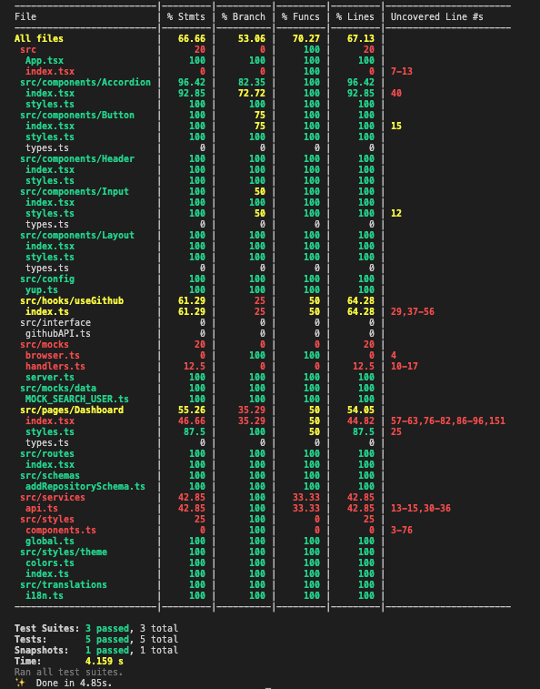

# GITHUB EXPLORER PROJECT

   

      Initial Render
   

   
   

  

   

      Search Result
   

   
   

  

   

      Demo
   

   
   

## Libraries
These are the main library for creating the UI
| Library                 | Description                              |
|-------------------------|------------------------------------------|
| react                   | For creating UI components               |
| axios                   | a promise-based HTTP Client              |
| styled-component        | CSS in JS writing component-based CSS    |
| react testing library   | unit test for react components           |
| msw js                  | API mocking library                      |
| i18next                 | internationalization-framework           |
| react-hook-form         | library to manage forms logic            |

## Deploy on Vercel

This project deploy on Vercel and you can access it through this https://github-explorer-project.vercel.app/

## Coverage Report

Create Unit Test and Integration Test using React Testing Library/JEST under `__tests__` folders

## Available Scripts
### `yarn start`

Runs the app in the development mode.\
Open [http://localhost:3000](http://localhost:3000) to view it in the browser.

The page will reload if you make edits.\
You will also see any lint errors in the console.

### `yarn test`

Launches the test runner in the interactive watch mode.\
See the section about [running tests](https://facebook.github.io/create-react-app/docs/running-tests) for more information.

### `yarn test:coverage`
Launches the test runner and providing test coverage to measure code quality

### `yarn run build`

Builds the app for production to the `build` folder.\
It correctly bundles React in production mode and optimizes the build for the best performance.

The build is minified and the filenames include the hashes.\
Your app is ready to be deployed!

See the section about [deployment](https://facebook.github.io/create-react-app/docs/deployment) for more information.

### `yarn run eject`

**Note: this is a one-way operation. Once you `eject`, you can’t go back!**

If you aren’t satisfied with the build tool and configuration choices, you can `eject` at any time. This command will remove the single build dependency from your project.

Instead, it will copy all the configuration files and the transitive dependencies (webpack, Babel, ESLint, etc) right into your project so you have full control over them. All of the commands except `eject` will still work, but they will point to the copied scripts so you can tweak them. At this point you’re on your own.

You don’t have to ever use `eject`. The curated feature set is suitable for small and middle deployments, and you shouldn’t feel obligated to use this feature. However we understand that this tool wouldn’t be useful if you couldn’t customize it when you are ready for it.
